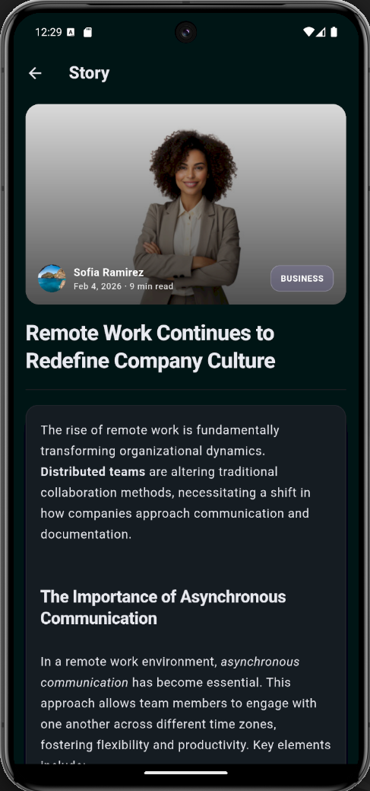
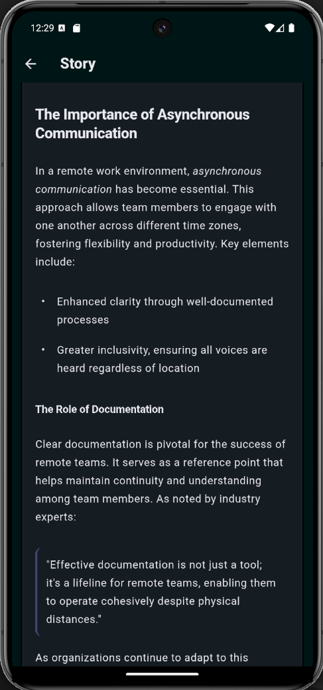
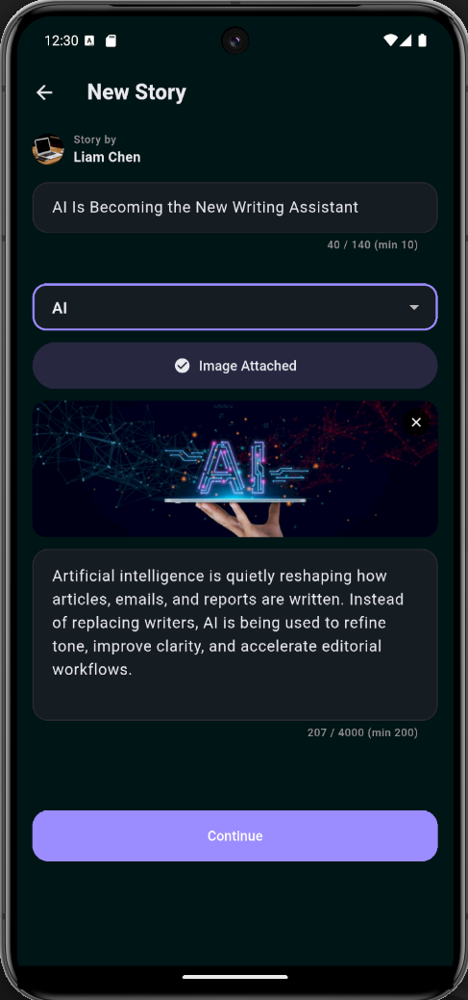
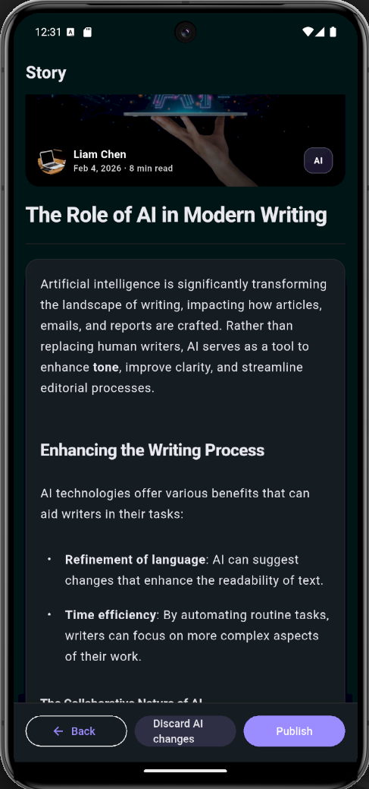
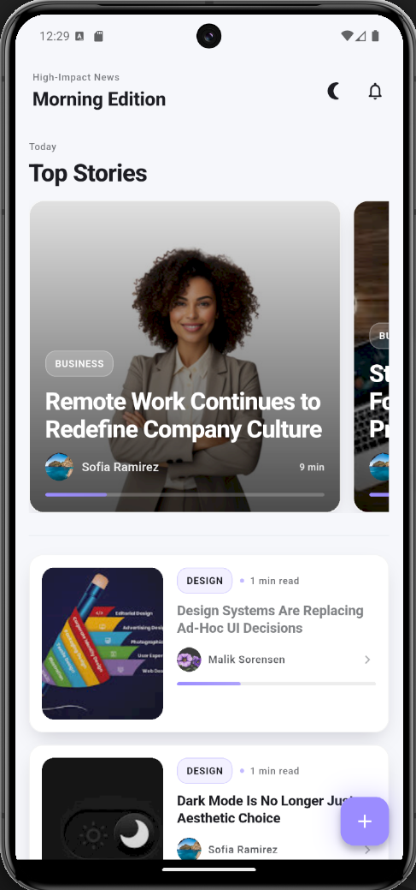
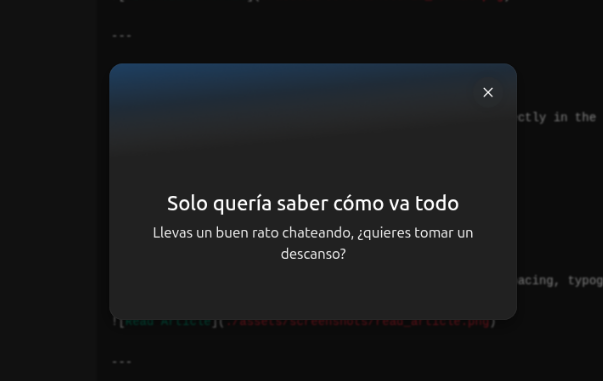

# Applicant Showcase App – Development Report

## 1. Introduction

This project felt both challenging and motivating from the start. I genuinely enjoy building products end to end, and this experience pushed me to do exactly that—think through details, solve real problems, and make things work smoothly. It was demanding at times, but also very rewarding, and it reflects the way I like to learn and grow as a developer.
---

### 2. Learning Journey

- Strengthened my understanding of **Flutter Clean Architecture** by clearly separating data, domain, and presentation layers.
- Gained hands-on experience with **Cubit/Bloc** for predictable and maintainable state management.
- Learned to integrate and debug **Firebase** components, including **Firestore**, **Storage**, and **Anonymous Authentication**, in real publishing workflows.
- Improved my development workflow by using **Flutter DevTools** and **structured logging** to trace permissions, data flow, and runtime issues.

---

### 3. Challenges Faced

- Ensuring **data consistency** between UI, Firestore, and Storage when writes initially failed silently.
- Debugging **Firestore permission issues** that caused the UI to succeed while backend writes were denied.
- Handling **null safety and schema mismatches** when reading articles back from Firestore.
- Solved these issues by adding **end-to-end structured logging**, validating payloads, and aligning DTOs with the Firestore schema.

---

## 4. Reflection and Future Directions

Overall, this project was a very rewarding experience. Technically, it strengthened my ability to build production-grade Flutter applications with clean boundaries, strong debugging practices, and real backend integration. Professionally, it reinforced my mindset of ownership: if something breaks, I trace it, understand it, and fix it properly.

For future improvements, I would consider:
- Adding pagination and caching to the article feed
- Introducing role-based permissions for editors vs readers
- Expanding the AI editorial feature with tone or length controls
- Adding analytics to measure reading engagement

This project reflects how I approach software: not just to make it work, but to make it understandable, debuggable, and scalable.

---

## 5. Proof of the Project

This section provides visual and functional proof of the final version of the Applicant Showcase App. Each artifact demonstrates not only technical correctness, but also strong editorial identity, product thinking, and user experience design.  
The items are ordered from **highest to lowest impact**.

---

### 🎬 End-to-End Product Experience — From Launch to Publish

This video showcases the complete lifecycle of the application: splash screen, home feed, article reading, AI-assisted editing, and publishing.  
It demonstrates cohesion between design, architecture, and real production behavior.

  ▶️ <a href="./videos/videoshowcase.webm"><strong>Watch Full App Showcase</strong></a>

---

### 🤖 AI-Assisted Journals — Where Editors Meet Intelligence

This feature introduces artificial intelligence as an **editorial assistant**, enhancing clarity, tone, and structure without replacing human authorship.

> *“Journals assisted with AI — human ideas, machine precision.”*

  ▶️ <a href="./videos/aifeature.webm"><strong>Watch AI Feature Demo</strong></a>

---

### 🏠 Home Feed — High-Impact Editorial Entry Point

The home feed acts as a **digital magazine cover**, prioritizing visual hierarchy, readability, and immediacy.  
Articles refresh automatically after publishing, reflecting real-time data from Firebase.

  

---

### 📖 Premium Reading Experience — Long-Form First

Articles are designed for immersive reading. Typography, spacing, and contrast were carefully tuned to support long-form content while maintaining a modern editorial aesthetic.

  

---

### ✍️ Format by Markdown — Writers Focus on Content

The app fully supports Markdown rendering, preserving semantic structure such as headings, emphasis, quotes, and lists.  
This allows writers to focus on storytelling while the system ensures consistent presentation.

  

---

### 📰 Multiple Editorial Formats — Human & AI-Enhanced

The platform supports both traditional articles and AI-enhanced drafts, enabling flexible editorial workflows and experimentation.

  
  &nbsp;&nbsp;
  

---

### 🌗 Adaptive Light Mode — Readability Without Compromise

Light mode is fully supported to ensure accessibility and comfort in different environments, while preserving visual identity and contrast.

  

---

### 🚀 Editorial Identity from First Second — Splash Screen

A clean, minimal splash screen establishes the app’s editorial tone immediately, reinforcing a premium product feel from launch.

  

---

## 6. Overdelivery

This project intentionally goes beyond the initial requirements by prioritizing **editorial intelligence, visual excellence, and product-level user experience**, aiming to feel like a real, premium digital publication rather than a technical prototype.

### ✨ New Features Implemented

**AI-Assisted Journalism Experience**  
An **Assistive AI for Journalists** feature was implemented to help writers improve drafts while preserving their original intent and voice. The AI focuses on clarity, structure, and editorial quality, positioning itself as a creative assistant rather than a content generator.

**High-Impact Editorial UI/UX**  
The application was designed with a strong editorial identity, emphasizing typography, spacing, and visual hierarchy. The reading experience was crafted to feel calm, focused, and premium—similar to modern digital journals and high-end news platforms.

**Dark / Light Mode with Visual Consistency**  
Full support for dark and light modes was added, carefully tuned to maintain readability, contrast, and editorial tone across themes without sacrificing visual identity.

**Markdown-Based Article Rendering**  
Articles support rich Markdown formatting, enabling expressive long-form content such as headings, quotes, lists, and emphasis. This allows journalists to write naturally while maintaining consistent visual presentation.

---

### 🧩 Prototypes Created

**Editorial-Oriented Clean Architecture**  
A scalable Clean Architecture was designed and implemented to support editorial workflows, clearly separating domain logic, data handling, and UI concerns for long-term maintainability.

**Firestore Editorial Data Model**  
A dedicated Firestore schema was designed for editorial content, ensuring consistency between articles, authors, metadata, and UI rendering.

---

### 🚀 How Can This Be Improved Further

Future enhancement ideas include:
- AI-powered article categorization and tagging
- Editorial dashboards with engagement analytics
- Offline reading and draft creation
- Personalized and adaptive content feeds
- Experiments with immersive and interactive article layouts

## 7. Extra Sections

### Code Quality & Observability
- Clean Architecture applied consistently
- Structured logs using `dart:developer`
- Defensive data mapping and validation
- Clear fallback strategies for repository failures

### Metrics
- End-to-end publish flow fully traceable
- Zero silent failures after logging integration
- Production-ready Firebase rules and schema

### 😂 *stopbro* — When Your AI Agent Checks on You

At one point during development, after hours of continuous coding, debugging, and shipping features at full speed, my AI assistant genuinely stopped and asked if I was okay.

That moment became a reminder of how deep I was in the flow—building, fixing, polishing, and pushing forward without pause. It captures the intensity of the process and the mindset of shipping features relentlessly, while still finding space to laugh at the journey 😅💻😂

---

## Final Note

Thank you for the opportunity to work on this project.

It represents how I approach real-world software development: taking ownership, building with clarity, and thoughtfully overdelivering beyond the initial requirements. More than an assignment, this was a space to create, learn, and ship something I’m genuinely proud of.
